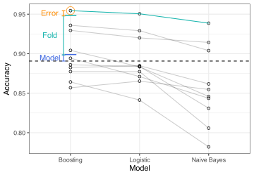

{fig-align="center" height="300px"}

We've released additional chapters in the last month or so. These conclude Part 3 of the book.

- [_Iterative Search_](https://aml4td.org/chapters/iterative-search.html) shows how to optimize tuning parameters using methods such as simulated annealing, genetic algorithms, and Bayesian optimization. This chapter also lays some of the groundwork for general Bayesian methods. 
- [_Feature Selection_](https://aml4td.org/chapters/feature-selection.html) is a survey of different methods and issues regarding the judicious removal of predictors. 
- [_Comparing Models_](https://aml4td.org/chapters/comparing-models.html) has a statistical focus on different ways to compare predictive performance within or between models. 

We've also updated the [tidymodels computing supplement](https://tidymodels.aml4td.org/) for these chapters. 

One nice feature of these updates is that many sections of the book have direct links to the computing supplement for that topic (as well as a return link).

Next up is Part 4 (Classification). A pull request is ready for review (on classification metrics), and the other chapters will describe various classification models. These may be released simultaneously as we fill in different sections of each (non-sequentially). 
